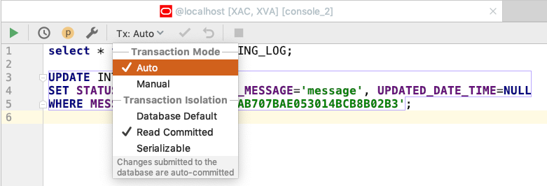

--# IDEA Workshop

## Quick tips

> Official Pro Tips: https://www.jetbrains.com/help/idea/pro-tips.html.

> CARET is the little blinking thing that you see when you type text.

> Learn default settings, try to avoid over customization.

> NoSQL has NoSupport.

> Do not version IDE specific files.

> In Idea placement of caret = context. And context will dictate what options will be available.

> Slow intelli-sense - SSD under heavy IO ?

> General caret moves work well: Cmd + Arrows, Shift + Cmd + Arrows, etc.

> The easiest way to learn Idea is by using : Tip of the day from Help menu

> Auto-curly braces in special blocks are added ad the end of the line or new line

1. When installing from scratch
    - Please do not install all plugins, it'll transform your IDE into trash

## General default behaviour

1. Facets
    - https://www.jetbrains.com/help/idea/facet-page.html
    - JPA
    - Spring
    - Works on steroids if Datasource is configured and assigned

1. Diff
    - Files from modules
    - Dirs from modules
       - Select 2 and `Cmd + D` 
    - Against external files
       - Select 1 and `Cmd + D`
    - `Right click` inside files : `Compare with Clipboard`
       - for selection
       - for entire file content
    
1. Integrated History
    - `Right click` inside files : `Local History`
    - `Right click` on any file or directory : `Local History`

1. Internal Terminal
    - `Right click` over any file and `Open in terminal`
    
1. `Right click` over any file and `Reveal in Finder`
    - Helps to open the file manager where the file is located and select the file

1. Bookmarks 
    - `F3` Toggle bookmarks
    - `Cmd + F3` Open list of bookmarks 

1. Breakpoints
    - Toggle
        - `Left click on the line`
        - `Cmd + F8`
    - Edit or set condition and Open breakpoints window
        - `Cmd + Shift + F8`
    - When in debug, the panels have a `Disable breakpoints button`

1. Hold cursor over a button, link, icon, etc. to get a tooltip with name of the feature

1. Support for `@Nullable`, with default highlight level set to `Warning`

1. Auto-contracts, deduced from method declaration: `@Nullable` vs `@NotNull`
    - An icon will appear at the line level to show the contract

1. Auto-re-index
    - IDE updates
    - Plugin updates
    - Corrupt indexes

1. File auto-save
    - Manual save still works, but useless

1. Help and documentation
    - Open online documentation
    - F1 Button in general view
    - Help button in popups, contextual info
       - how info is organized

1. Scroll from and scroll to features

## Plugins

1. **Plugin:** Presentation assistant

1. **Plugin:**  IntelliLang
    - *Auto activated*
    - `Ant + Enter` inside the content where custom language is present
    - https://www.jetbrains.com/help/idea/using-language-injections.html
    - Language injections

### Integration

1. **Plugin:** Docker Integration
    - Advanced UI like Kitematic
    - Detection of dockerfiles with Run support

1. **Plugin:** Git
    - Git log
    - Blame
    - Git-Undo per section of a file `Cmd + Alt + Z`
    - Compare with

1. **Plugin:** Maven
    - Show basic phases only, and other settings
    - Run phases
    - Select multiple and run
    - Can be configured at project level and IDE level
    - By default has one integrated
    - If you change version of a plugin in pom.xml - Check the logs, IDEA could use the previous version of it
    - `Preferences - Build, Execution, Deployment - Build Tools - Maven - Ignored Files` - be aware of this list
    
1. **Plugin:** .ignore
    - Help manage `.ignore` files
    - With highlight support
    - Can generate ignore files for various platforms

1. **Plugin:** Database tools and SQL
    - Can CRUD database
    - Cannot change admin rights via UI
        - but can do it via SQL
    - Advanced table visualization features
    - For oracle Docker images you need to put in Username field: `sys as sysdba`
    - Tables are used for auto completion in SQL files from source code
    - `Tx:` setting should be considered
        - 
1. **Plugin:** Http client
    - https://www.jetbrains.com/help/idea/http-client-in-product-code-editor.html#viewingResponse
    - Supports composing of requests in a text way
    - Can use `.http`or `.rest` files
    - Can be configured via `rest-client.env.json` or `http-client.env.json`
        - Yet, somehow is limited
    - Have support for Spring controllers, just like Run button for routes

## Settings

We distinguish 2 categories

1. IDE settings, applicable to all modules and IDE itself
1. Module level settings

Most of the settings described here are available on both levels

1. **Setting:** `Editor / Inspections -> Java : Logging` Placeholders
    - Set to warning, so that SLF4J shows if you have a missmatch between passed params and placeholders in the message.
1. **Setting:** `Editor / General -> Maximum number of contents to keep in clipboard`
    - You can change content before selecting it for pasting
1. **Setting:** `Cmd + Shift + 8` Column mode on/off 
    - `Cmd + Shift + A` type *Column mode*, hit `Enter`
    - `Alt + Shift + Mouse Left Click` : put carets under cursor 
    - https://www.jetbrains.com/help/idea/working-with-source-code.html#multiple_cursor
    - Working with *multiple carets*
1. **Setting:** `Editor / Code Style / Java -> Group Declarations : Align fields in columns`
    - Group / align fields in one column and values after equals in other column
1. **Setting:** `Editor / General -> Highlight on Caret movement : Highlight current scope`
    - Group / align fields in one column and values after equals in other column
1. **Setting:** `Editor / General Smart Keys -> Surround selection on typing quote or brace`
    - The selected text get brackets or quotes instead of replacing
1. **Setting:** `Languages & Frameworks / SQL Resolution Scopes`

###Within IDE

1. Bottom right corner : `4 spaces` change indentation
1. Bottom right corner : `Togle read only attribute` file

## Generation, completion and popup'ed information

1. `Alt + Enter` The smart contextual aware thing
    - swiss army knife for various contexts
    - can generate code for a lot of situations
    - have different options
    - underlined words like errors - are focused and first option of `Alt + Enter` is available by default
       - when a class is used but not imported and Idea knows it
    1. `Alt + Enter, then Esc, then Alt + Enter` 
    - sometimes invoking `Alt + Enter` second time gives other options
1. `Ctrl + Space` Code completion
1. `Alt + Space` Quick definition, shows the implementation of the symbol
1. `F1` Quick documentation
1. `Cmd + N` New File, Class, etc.
1. `Cmd + Shift + N` New scratch file.

## Navigation

1. **Navigation:** `F2` Goes to next issue
    - Next error, if there errors
    - Next warning, it there are no errors but are warnings
1. **Navigation:** `F4` Open module settings
    - Of the selected module
1. **Navigation:** `Shift + Shift` Search everywhere
    - `Cmd + Shift + A` - Actions only
    - https://www.jetbrains.com/help/idea/searching-everywhere.html
1. **Navigation:** `Ctrl + Tab` Navigate in open tabs and panels
1. **Navigation:** `Cmd + E` Navigate in recently closed files and panels
1. **Navigation:** `Esc` to go to the main Editor
    - Not consistent when using Split tabs
1. **Navigation:** `Shift + Esc` to go to the main Editor and close current panel
1. **Navigation:** `Cmd + Alt + ←` (*leftwards arrow*) Go **back** to previous caret location
1. **Navigation:** `Cmd + Alt + →` (*rightwards arrow*) Go **forward** to previous caret location
1. **Navigation:** `Cmd + O` Open class
    - Press 2x to `Include non project files - the ones from libraries`
1. **Navigation:** `Cmd + Shift + O` Open file
    - Press 2x to `Include non project files - the ones from libraries`

## Selection

1. **Selection:** `Cmd + C` : WHEN NO SELECTION - Copy line
1. **Selection:** `Cmd + X` : WHEN NO SELECTION - Cut line

1. **Selection:** `Alt + ↑`(*upwards arrow*) : multiple times
    - Select word
    - Select expression
    - Select whole line
    - special behaviour on code elements
1. **Selection:** `Alt + ↓`(*downwards arrow*) : multiple times
    - De-Select word
    - De-Select Expression
    - De-Select Whole line
    - special behaviour on code elements

## Edit
    
1. **Edit:** `Cmd + V` Paste and has integrated column mode support
1. **Edit:** `Cmd + D` Duplicate line or selection
1. **Edit:** `Cmd + Backspace` Delete line
1. **Edit:** `Cmd + Ctrl + G` Select all occurrences of a word inside a file
    - so that you can edit the selection
    - very close to what `Shift + F6` does for symbols - limited to current file scope
1. **Edit:** `Cmd + Alt + M` Extract method
    - Create a function from selection
1. **Edit:** `Cmd + Alt + C` Extract constant 
    - Create constant from selection
    - Move a hardcoded string or numeric value to a constant
1. **Edit:** `Cmd + Shift + U` Change case 
1. **Edit:** `Ctrl + Shift + V` Paste from History 
1. **Edit:** `Cmd + Shift + ↑`(_upwards arrow_) : move element up
1. **Edit:** `Cmd + Shift + ↓`(_downwards arrow_) : move element down
    - The functionality is contextual
    - Line
    - Function
1. **Edit:** `Cmd + Alt + L` Reformat
    - Can be applied only to selected portion
    - Can be applied to a folder
1. **Edit:** `Ctrl + Alt + O` Optimize imports
    - Remove unused classes, ignore classes used in comments
    - Apply format rules for import statements 
    - Can be applied to a folder
1. **Edit:** `Shift + Enter` Start a new line under current one and move caret to it
1. **Edit:** `Cmd + Enter` Split current line, move the content after the caret to a new line

